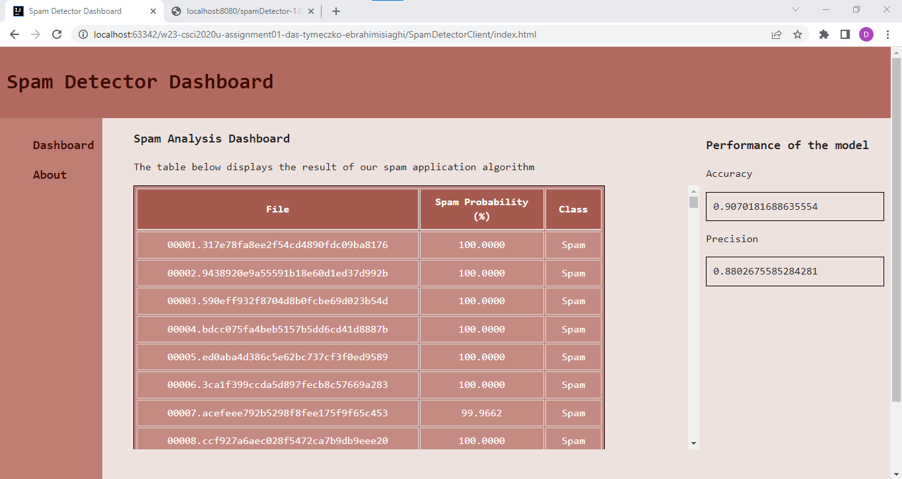

# Spam Detector
###### *This was a university project, copying code not allowed*


## Developers:
* #### [Siddhant Das](https://github.com/Sid-26)
* #### [Sheida Ebrahimi Siaghi](https://github.com/Sheida-Ebrahimi) 
* #### [David Houle-Tymeczko](https://github.com/DavidHTwastaken)

## Project Overview
Our project uses naive Bayes spam filtering to find the probability that an email, given in a text file, is spam.
The training files are used to create a map that associates each word to the probability of a file being spam given that it contains the word.



## API
After training the model, we use to test on additional spam and ham files. Then we store the data in an object of the class TestFile. We calculate the precision and accuracy. Then send those data in a JSON file to the server by creating an HTTP GET request for the API.

The Rest API module is created using Jakarta RESTful Web Service. Then the server is ran through glassfish.

## The Interface
When the initial UI look was done, we tried to make it look more aesthetically pleasing by changing the colour palate and the default font to something easier on the eyes. Additionally, the “blue” and “purple” looking links were changed into a set colour, and an underline would appear whenever the user hovered them. Finally, we made the table scrollable with a fixed index so that the user would be able to see it after scrolling down, and the column sizes were adjusted based on their values’ size.

## Algorithm Improvements
To avoid errors from adding or subtracting infinity due to a word having a frequency of 0, we start counting at 1.
We have also added the second ham folder into the training phase to increase the sample size of words and files.

## How to Run
In order to clone and run our application, follow these steps:
1. Clone the project from GitHub into a local directory (e.g. a folder named “SpamDetection”)
2. Open the directory from Step 1 in Intellij IDEA and run the Maven build script
3. Set up Glassfish configuration by following the instructions of Intellij IDEA
    -  when prompted to select deployment artifacts, choose the option ending in “:war exploded”
4. Run the Glassfish server and wait for deployment
5. Open “index.html”

## Resources
main.css - https://github.com/h5bp/main.css
normalize.css - https://github.com/necolas/normalize.css
loader.css - https://cssloaders.github.io
HTML Boilerplate - https://html5boilerplate.com
Improvement Ideas - https://www.baeldung.com/cs/naive-bayes-classification-performance


# Instructions (Provided by template) (ignore)

This is the template for your Assignment 01.

## Overview
You have become frustrated with all the advertisements in your inbox. You resolve to create a spam detector to filter out the spam. The spam detector will use a dataset of E-Mails (spam or otherwise) to train your program to recognize whether or not new E-Mails are spam. The program will use a unigram approach [1], where each word is counted and associated with whether or not the message is spam. Your program will calculate probabilities based on each word’s frequency [2]. Luckily, you have not emptied your spam folder or inbox in quite a while, so you have many samples to use to train your system.

- Check the `Canvas/Assingments/Assignment 01` for more the detailed instructions.

### SpamDetectorServer - Endpoints

**Listing all the test files**

This will return a `application/json` content type.
- `http://localhost:8080/spamDetector-1.0/api/spam`
  See a sample of the response data:
```
[{"spamProbRounded":"0.00000","file":"00006.654c4ec7c059531accf388a807064363","spamProbability":5.901245803391957E-62,"actualClass":"Ham"},{"spamProbRounded":"0.00000","file":"00007.2e086b13730b68a21ee715db145522b9","spamProbability":2.800348071907053E-12,"actualClass":"Ham"},{"spamProbRounded":"0.00000","file":"00008.6b73027e1e56131377941ff1db17ff12","spamProbability":8.66861037294167E-14,"actualClass":"Ham"},{"spamProbRounded":"0.00000","file":"00009.13c349859b09264fa131872ed4fb6e4e","spamProbability":6.947265471550557E-12,"actualClass":"Ham"},{"spamProbRounded":"0.00000","file":"00010.d1b4dbbad797c5c0537c5a0670c373fd","spamProbability":1.8814467288977145E-7,"actualClass":"Ham"},{"spamProbRounded":"0.00039","file":"00011.bc1aa4dca14300a8eec8b7658e568f29","spamProbability":3.892844289937937E-4,"actualClass":"Ham"}]
```

**Calculate and get accuracy**
This will return a `application/json` content type.
- `http://localhost:8080/spamDetector-1.0/api/spam/accuracy`
  See a sample of the response data:
```
{"val": 0.87564}
```

**Calculate and get precision**
This will return a `application/json` content type.
- `http://localhost:8080/spamDetector-1.0/api/spam/precision`
  See a sample of the response data:
```
{"val": 0.56484}
```
### SpamDetectorServer - SpamDetector class

Most of your programming will be in the `SpamDetector` class. This class will be responsible for reading the testing and training data files, training, and tesing the model.

> Obs1. Feel free to create other helper classes as you see fit.
>
> Obs2. You are not expected to get the exact same values as the ones shown in the samples.

### References
[1] https://en.wikipedia.org/wiki/Bag-of-words_model

[2] https://en.wikipedia.org/wiki/Naive_Bayes_spam_filtering 
